# Philipp Sandner

- Digital Assets have not progressed so much over the last years
- But now regulation is in place (Mica, ...)
- Retail customers are not buying debt instruments and this is aggravated by inflation and yield rise
- Institutional customers are not yet really active on the market
- No liquid secondary market in particular for retail investors
- Equity tokenization is not yet there (at least in Germany)
- Now people understand what is missing and the tokenization topic could pickup next year
- Tokenization of carbon credits is a very hot topic: there is infrastructure to replace for that market 
- Same applies for Hydrogen which is created either from clean or dirty energy

# EY - Magus Jones - NFT Regulatory Framework

- What about VAT on the the NFT sales performed on an exchange? 
- The governments have not yet the tools nor the knowledge to manage those use cases but they will and will also act retrospectively
- EY has never been confronted to a 100% clear situation helping their customers on that matter. The regulatory framework is not yet complete
- Royalties also trigger some new questions: if a buyer of an Nft is sitting in North Korea, then the author is getting money from the new owner. Is this legit?
- Twitter and discord and all social media channel should not contradict the prospectus which is also needed
- If there is a gain there is a tax!

The government will be looking at this in particular considering the market growth:

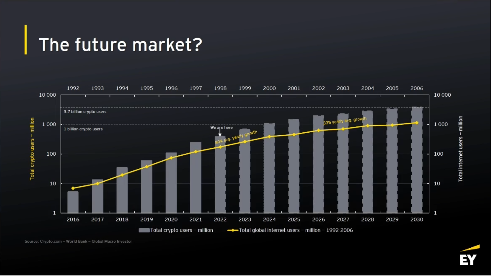

More people own crypto than shares

- EY is in the metaverse to learn and also to attract the younger generations
- Denmark is setting up a share registry based on Ethereum and this is also displayed in Metaverse

# .msg - Compliance experts for crypto

Types of frauds:

Crypto Crime is insignificant for now compared to the traditional banking where estimates are between 1.9T to 4.8T per year

The Nft market and in particular the art market is seen as have an interesting potential for money laundering
The tools like chainanalysis or others are important but what is even more important is the process around those tools.

Is the regulation hindering innovation?

Outsourcing the custody means that processes have to be verified. This is not because a provider has a licence that the 
processes are completely following what has been described and approved by the regulator

The insurance the custodian has must be checked, onsite inspection of the custody is also needed

We are going to need a lot of custodians because all the assets have to be stored safely

# Electronic Security Infrastructure D-Fine - Marcus Hennig

The Digital Securities German market is now regulated by the German Digital Securities Act.

Even though the challenges listed above are calling for a private blockchain, a private blockchain is not necessarily seen
as the optimal solution qs it would not be very different from the current system and would limit drastically innovation

# SWIAT Blockchain for regulated financial entities - Jonathan Lessmann

Swiat is trying to build a permissionned blockchain for financial institutions. The aim is to copy the mobile market offering
a platform where applications can be deployed by the different banks competing one against the other. The environment is EVM compatible
The identification of the banks employees' is performed directly on the blockchain with an identification layer. The banks can therefore 
have their own workflows and the actors are clearly authorized by the bank to perform the tasks they perform.
Swiat is a subsidiary of DekaBank

# Round tables

- DlT is obviously tremendously helpful for settlements
- DLT could also allow more frequent coupons than quarterly or semi-annual
- People see that multiple networks will co-exist needing to interoperate
- Only 4% of the companies are holding BTC on their balance sheet, which another 4% through ETFs
- The obstacles for more institutional adoption are:
  - Regulation which is not yet fully clear in particular cross jurisdiction
  - Very punitive to hold crypto on balance sheet: no intermediation possible, no prime brokerage
  - Liquidity for 10M BTC OTC is the only way and the fee is 2%
- Hot use cases:
  - Lending and Borrowing
  - Digital identity
  - Market data
  - Cross border payments: pros: always on, programmable but scalability is an issue as well as travel rules. Cross border CDBC is also interesting
  - Most of the attacks are coming from bridges between networks
- Not enough competition in the custody area in Germany as there are only 2 custodians
- The awareness and the education in the market is an issue as the management levels do not understand Blockchain
- The retail market in Asia is much bigger than in Europe

# WeOwn : a tokenization suite

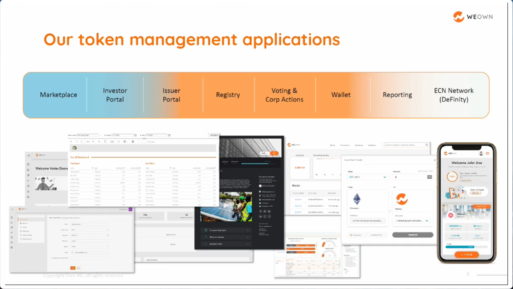

ECN for Fx trades with Blockchain for settlements

In order to successfully introduce a new technology such as Blockchain it has to bring value. The existing infrastructure even if sub-optimal
works. But, the reconciliation processes are really a pain and cost a lot. This is where the Blockchain technology can make a difference.

# Intas.tech

# WM

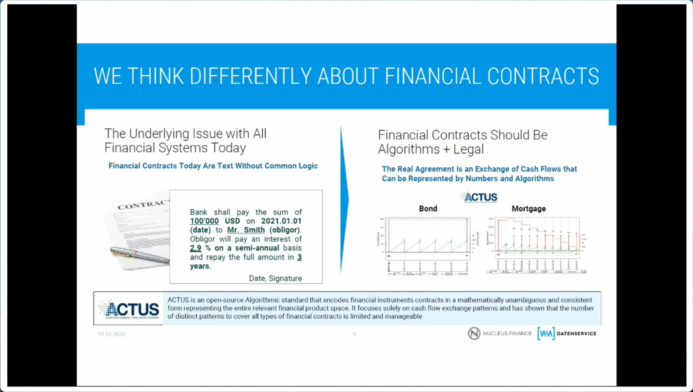

WM offers tokenization as a service, leveraging their existing positioning:

- SG-Forge is issuing mainly bonds on public networks. They also try to tap other liquidity pools.
- A gain of even a little efficiency in the repo market makes a real difference (even 1/4 of a basis point)
- Union investment is working on a smart contract to replicate an interest swap
- Instant settlement is really a huge efficiency gain as settlement is currently performed in 3 days and not in 2 days
- Fractionalisation and pre Ipo shares are also very interesting use cases
- JP Morgan has now more than 60 employees looking at blockchain to improve Back Office efficiencies
- JP Morgan sells crypto products to a variety of customers and not only to hedge funds as before
- On the Back-Office side, very often all the financial products are managed in different chains. The expectation with 
Blockchain is that is not only reducing the reconciliation effort but also reducing the number of systems dealing with the different products
- The volumes on crypto currencies is increasing at JP Morgan
- The issuance side is pretty attracted by the digital products, the buy side is lagging behind for now
- The buy side is expecting lower fees thanks to the efficiency gains

# Round table on CO2 market

This market is not efficient and has no infrastructure and therefore, it is a very interesting area to use blockchain technology
The proposition is to tokenized CO2 certificates so that CO2 producers can trade with CO2 absorbers. Blockchain is also used for its
integrity and traceability capabilities solving some quality issues in the CO2 market.

# RAT

This tokenization project is focusing on fractionizing assets but in the perspective of using those assets, not for speculation

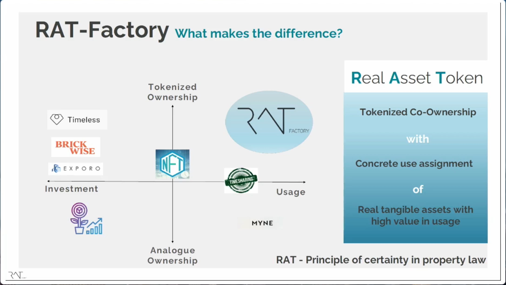

This means that a validator must ensure the link between the physical asset and the token and the token usage

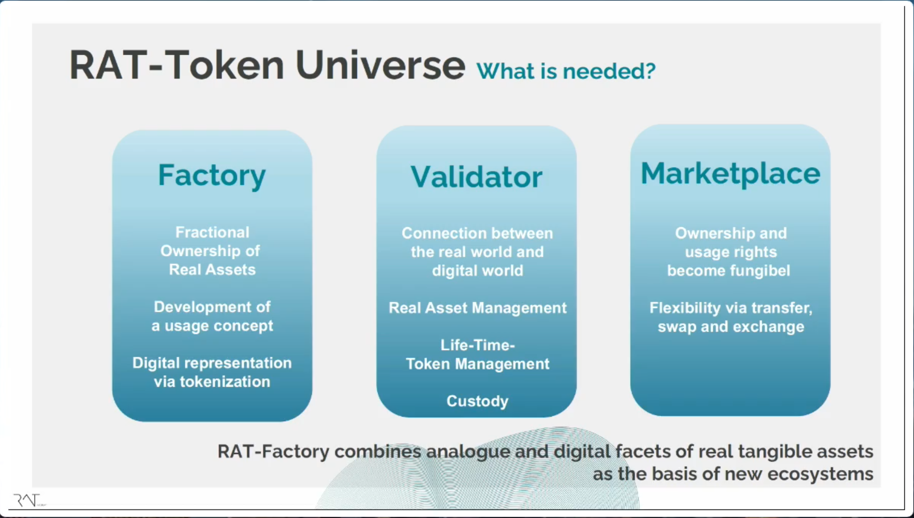

Shared usage and propriety are the classical examples:

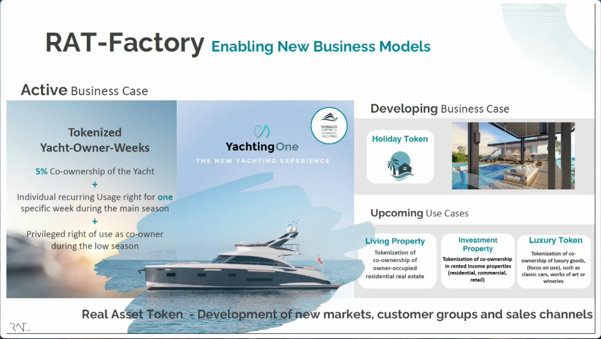

This is combining together:
- Co-ownership
- Time sharing
- Tokenization

Benefits example for a yacht:

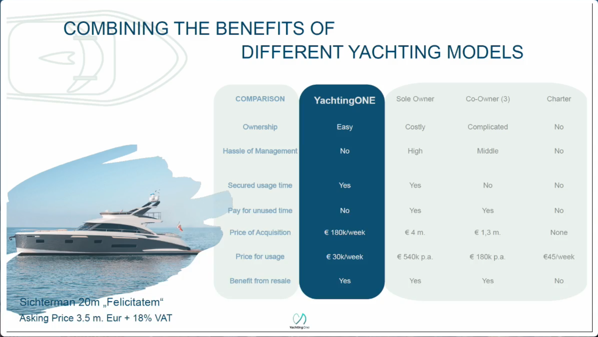

# CBDC

Most countries are working on CDBC and most of them have no clue about what do to with CDBCs

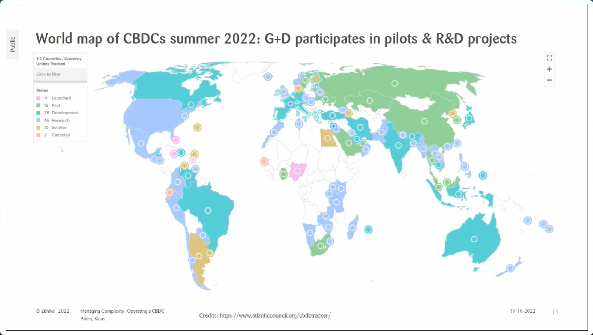

To illustrate the different views, it varies from wholesale to retail:

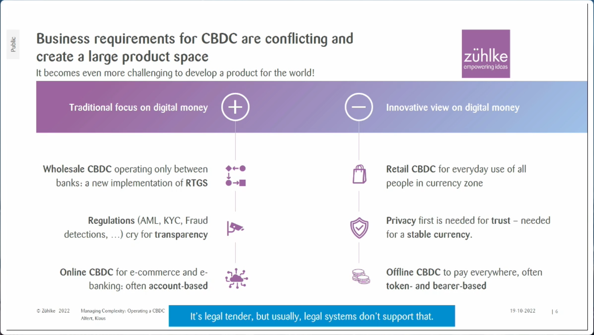

Performance is obviously an issue: it is estimated that the transaction throughput should be around 100tps per 1Mio inhabitants

# Basenode.io

Paying freelancers with stablecoins

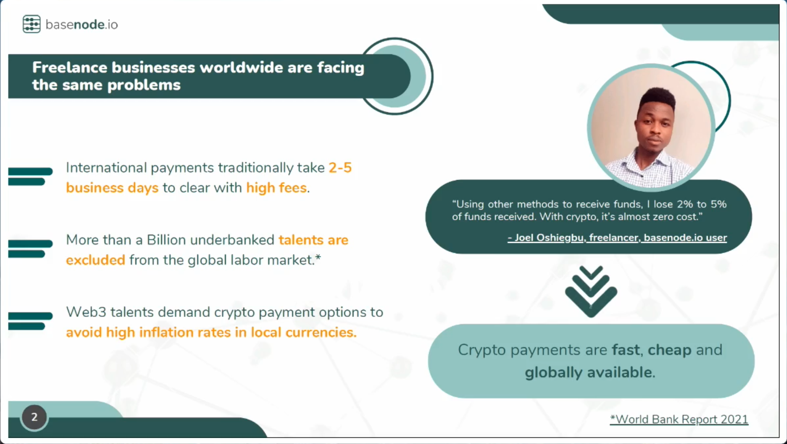
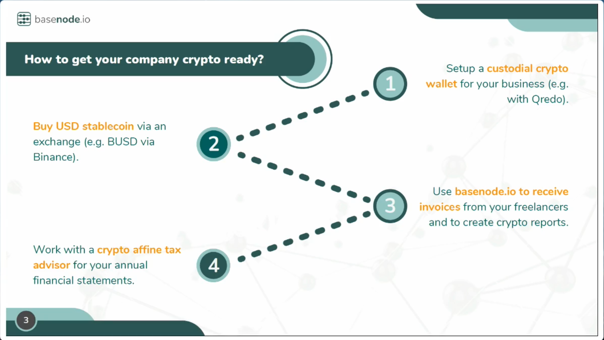

# Stable coins

Mica is stabilizing the regulation for stable coins in EU. This is important for the Euro zone to be able to compete with 
the US and China which are far ahead regarding stable coins or CDBCs

Companies could take advantage of stable coin to automate payments, more intelligent payment, cross border payments, ...